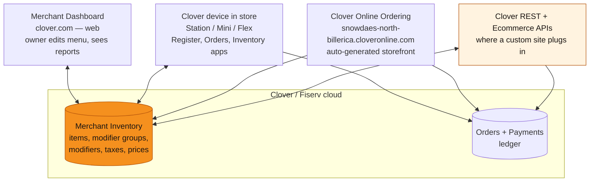
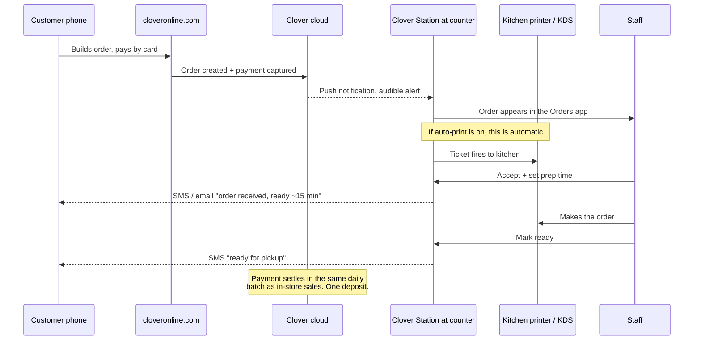
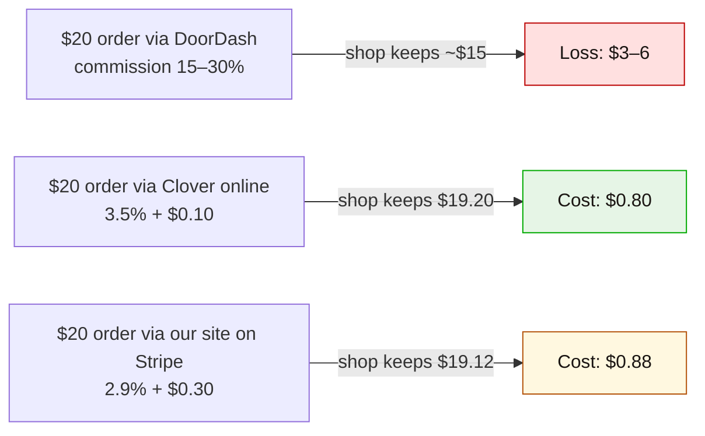
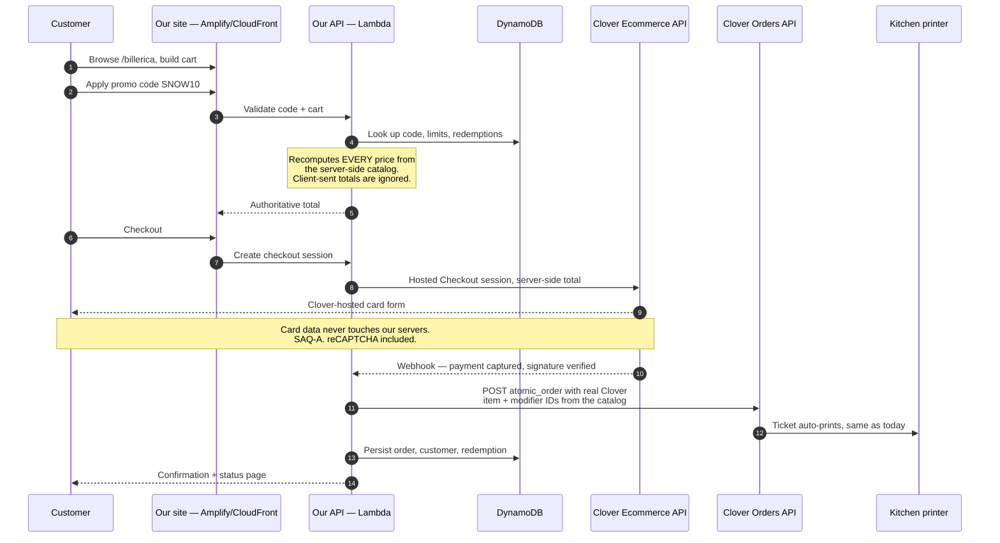
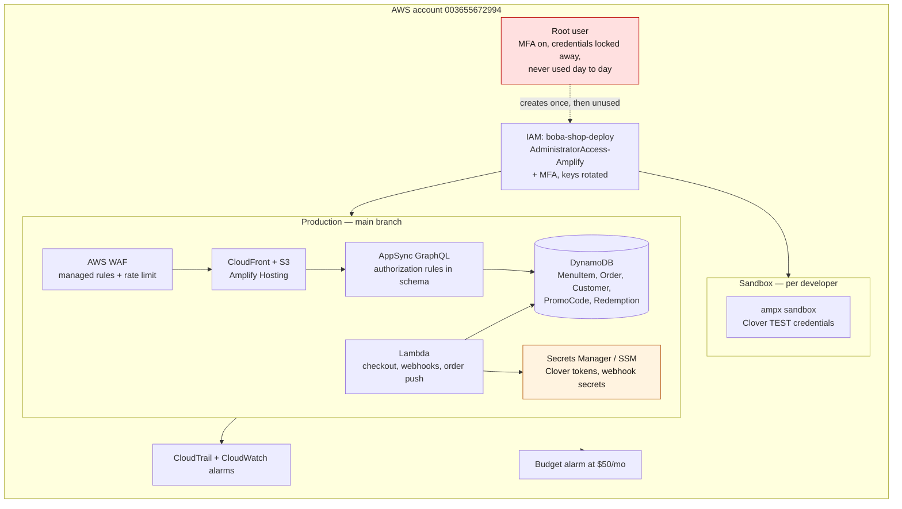
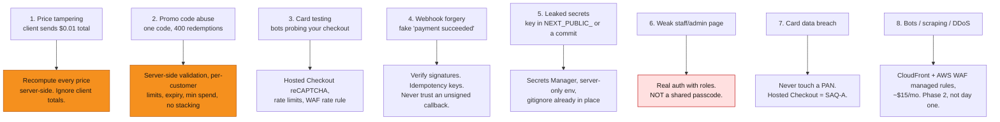
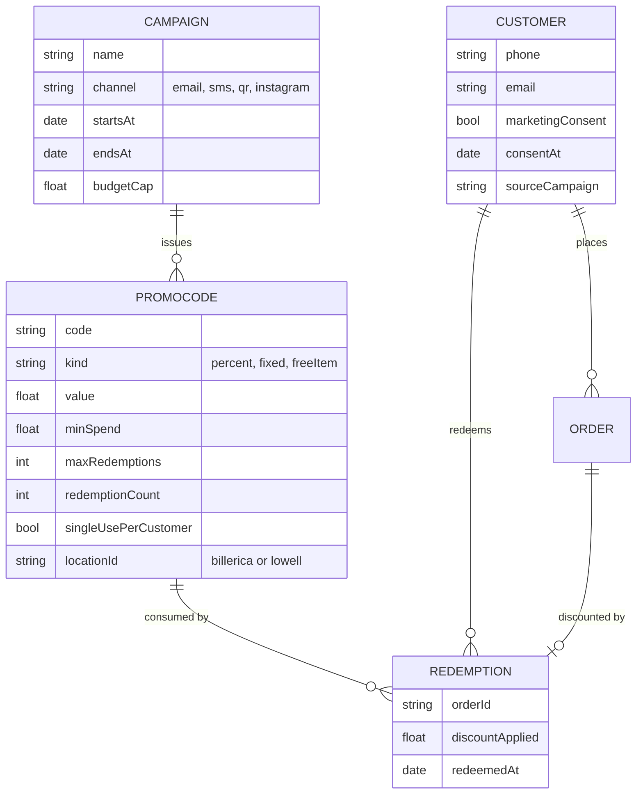
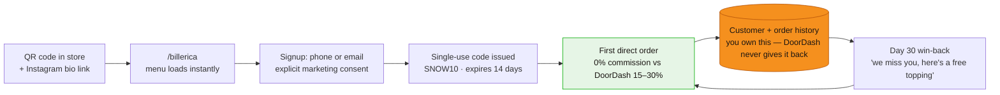
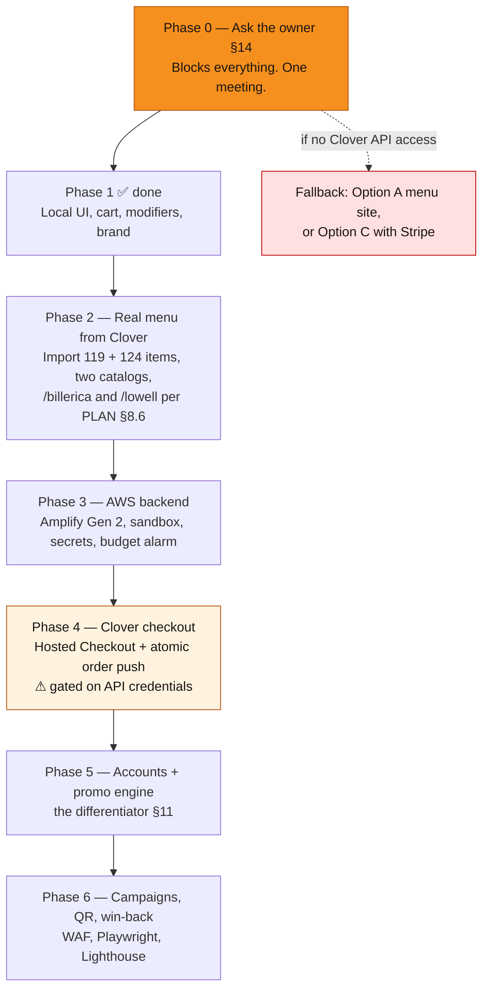

# Clover, Payments, AWS & Launch — the decision brief

> **Also published as a page** (rendered diagrams, easier to hand to someone): <https://claude.ai/code/artifact/3a1c2780-f0fd-4478-98ab-4fdcee69bbf8>
> Rebuild it with `node scripts/build-brief.mjs`, then republish to that same URL — the source is `docs/brief.tpl.html` plus the mermaid blocks in this file.
>
> **Purpose.** You have a working storefront UI and no cloud. Before wiring Phase 2/3 you need to know: what Clover actually is, what the shop sees when an order lands, what it costs, whether we replace it or plug into it, how to stand this up on AWS without leaving the door open, and which parts to buy instead of build.
>
> **Status: DECIDED 2026-08-27 — Option B.** Keep Clover for everything, and integrate with it. Recorded in `PLAN.md §8.7`, which also lists the amendments now applied there. The analysis below stands as the reasoning; §6 has been updated with the access path, and §14's owner questions are still outstanding.
>
> **One correction since first publication:** this brief originally said a *private app* would let us skip Clover's approval queue. That was wrong — private apps still require approval. The real path is better: **merchant-generated API tokens**, which the owner creates from their own dashboard with no app and no approval at all. See §6.

---

## 1. The one-page answer

| Your question | Short answer |
|---|---|
| How does Clover work? | A POS company owned by Fiserv. **Inventory is the single source of truth**; the ordering site at `*.cloveronline.com` is just a rendering of it, and the in-store tablet reads the same data. §2 |
| What does the store see when an order comes in? | It lands in the **Orders app** on their Clover device with an alert, usually **auto-prints a kitchen ticket**, and staff accept it and set a prep time. This is the workflow we must not break. §3 |
| What does Clover charge? | Software $0–$90/mo per device, card-present ~2.3–2.6% + $0.10, and **card-not-present ~3.5% + $0.10** for online orders. Their online ordering itself takes **no commission**. §4 |
| Should we link payments through Clover or not? | **Through Clover.** Charge on their existing merchant account via Clover's Ecommerce API, and push the order into their POS with the Orders API so it prints on the same printer as today. §5–§6 |
| Do I need a CDN? | Yes, and you already get one — Amplify Hosting is CloudFront underneath. Budget $0–5/mo. §8 |
| How do I not get hacked? | Never touch a card number, **recompute every price server-side**, and treat promo codes as the thing attackers will actually abuse. §9 |
| Don't reinvent the wheel — what do I buy? | Auth, payments, email/SMS, analytics. **Build only the discount-code engine**, because nothing off-the-shelf plugs into a custom cart and Clover doesn't have one. §10 |
| What's this cost to run? | **~$5–40/month** all-in on AWS, plus card processing that stays roughly what they already pay. §11 |

**The single most important reframe:** the money in this project is *not* in the processing rate (§4.3). It is in taking orders back from DoorDash, owning the customer list, and running campaigns Clover cannot run.

---

## 2. How Clover actually works

Clover is three layers over one database. Once you see that, everything else follows.



**The three things worth internalising:**

1. **The online store is not a separate system.** `snowdaes-north-billerica.cloveronline.com` has no menu of its own. The owner edits an item in the Clover dashboard and the website changes. That is why our scraper in `scripts/fetch-clover.mjs` finds a complete, structured catalog: it *is* their inventory.

2. **Every ID we already hold is a real Clover inventory ID.** From `assets/clover/billerica.json`:

   ```json
   { "id": "28XHGQDK3TNHM", "name": "Pandan Mango Sticky Rice", "price": 865,
     "modifierGroupIds": ["WCX2453DNC6TR", "PFK8A1CWC1444"],
     "taxIds": ["NHWS2PP5AT8PW", "A16YCATHNY5CY"] }
   ```

   `price` is in cents. `28XHGQDK3TNHM` is the identifier Clover's Orders API expects. **This is the unlock for §6** — we are not scraping a menu, we are holding the keys needed to write orders back in.

3. **Two tax IDs on every single item, at both stores** (119/119 and 124/124, 2 distinct IDs each). That is almost certainly MA state meals tax + the local option meals tax. Confirm it (§12-F) rather than hard-coding the 8.75% currently mocked in `src/store/useCart.ts`.

**Clover is processor-locked.** Clover hardware is tied to the processor it was sold through, and the rates depend on which reseller sold it — Clover direct, a bank, or an ISO. You cannot swap in your own gateway for the in-store terminal. This matters because it means we cannot "move the shop to Stripe" without them abandoning their POS, which will not happen.

---

## 3. What the store actually sees when an order comes in

This is the part with no documentation you can trust, because it depends on how *their* devices are configured. Here is the standard flow — treat it as the hypothesis to verify in §12-B.



**Why this diagram decides the architecture.**

- Staff have **one screen** they already watch. Any design that adds a second screen — a tablet showing *our* orders alongside the Clover Station showing *theirs* — will get ignored during a rush, and a missed order is worse than no website.
- **`PLAN.md` Phase 4 proposes exactly that second screen** (`/kitchen`, tap-to-advance). That is the right build if we replace Clover entirely, and the wrong build if they keep it. Do not build `/kitchen` until §12-B is answered.
- Payment through Clover means **one settlement batch, one deposit, one sales-tax number, refunds where staff already do refunds**. Payment through Stripe means two of each, forever. Bookkeeping pain is a real cost, just not one that shows up in a fee table.

---

## 4. What Clover charges

Rates vary by reseller, so these are ranges. The only authoritative source is one of their monthly statements (§12-A).

### 4.1 The line items

| Charge | Typical 2026 figure | Notes |
|---|---|---|
| Software plan, per device/month | $0 / $14.95 Essentials → $59.95 Counter Service → $89.95 Table Service | Restaurant tiers include online ordering |
| Card present, in store | ~2.3% – 2.6% + $0.10 | Varies most by reseller |
| **Card not present — online orders** | **~3.5% + $0.10** | The number that matters here |
| Clover Online Ordering commission | **$0** | No commission, no setup fee |
| Hardware | Purchased or leased | Sunk cost; already theirs |
| Clover Customer Engagement | Free with the POS | Basic promos/loyalty — see §10 |

### 4.2 What Clover's online ordering can't do

The gap that justifies this whole project is not price, it's capability. Clover Online Ordering has **no promo/discount code support** — the feature request to "integrate the discounts app with online orders" was only moved to *Planned* in April 2026, still unshipped. There is also no campaign attribution, no first-order incentive, no cart-abandonment follow-up, and no control over the funnel.

**"Sign up, get 10% off your first order" is literally impossible on their current site.** That is the sharpest line for the pitch, and it is a capability argument, not a cost argument.

### 4.3 The fee math that changes the pitch ⚠️

`PLAN.md §2.2` sells "Direct Stripe processing: standard card fees $0.30 + 2.9%" as a win over "DoorDash/Uber Eats 15–30%". True against DoorDash. **Not true against what they already pay Clover.**

Clover CNP `3.5% + $0.10` vs Stripe `2.9% + $0.30`:

| Ticket | Clover online | Stripe | Winner |
|---|---|---|---|
| $10 | $0.45 | $0.59 | Clover |
| $15 | $0.63 | $0.74 | Clover |
| $20 | $0.80 | $0.88 | Clover |
| $30 | $1.15 | $1.17 | Clover |
| **$33.33** | **$1.27** | **$1.27** | break-even |
| $50 | $1.85 | $1.75 | Stripe |

Stripe's higher fixed fee ($0.30 vs $0.10) beats its lower percentage until the ticket clears **$33.33**. Average item price is **$5.83 in Billerica, $4.87 in Lowell** — a two-drink order is nowhere near $33. **Moving them to Stripe would make each order slightly more expensive, not cheaper.**

Where the money actually is:



**The pitch is "convert aggregator orders into direct orders, and run marketing Clover can't" — not "cheaper processing."** Rewrite `PLAN.md §2.2` accordingly before it is shown to anyone.

---

## 5. Three ways to build this

```mermaid
graph TB
    subgraph A["Option A — Menu site, Clover keeps checkout"]
        A1["Our Next.js site<br/>menu, brand, marketing"] -->|"Order Now deep link"| A2["cloveronline.com<br/>cart + payment + kitchen"]
    end

    subgraph B["Option B — We own the storefront, Clover owns money + kitchen ⭐"]
        B1["Our site<br/>cart, modifiers, accounts,<br/>promo codes, campaigns"] --> B2["Clover Ecommerce API<br/>Hosted Checkout / iframe"]
        B2 --> B3["Clover Orders API<br/>atomic order, real inventory IDs"]
        B3 --> B4["Prints on their existing<br/>kitchen printer"]
    end

    subgraph C["Option C — Full parallel stack, current PLAN.md"]
        C1["Our site"] --> C2["Stripe Checkout"]
        C2 --> C3["DynamoDB orders"]
        C3 --> C4["Our own /kitchen tablet<br/>⚠ second screen"]
    end

    style B fill:#fff3e0,stroke:#b4530a,color:#1a1512
    style C4 fill:#ffe0e0,stroke:#b00,color:#1a1512
```



| | **A — Link out** | **B — Clover-backed ⭐** | **C — Parallel stack** |
|---|---|---|---|
| Build effort | Days | 3–5 weeks | 6–10 weeks |
| Staff workflow change | None | **None** | New screen to watch |
| Money rails | One | **One** | Two — separate deposits, tax, refunds |
| Own the cart / UX | ✗ | ✓ | ✓ |
| Discount codes | ✗ | ✓ | ✓ |
| Own customer data | ✗ | ✓ | ✓ |
| PCI burden | None | **SAQ-A** — never touch a card | SAQ-A |
| Needs owner cooperation | Low | **Medium** — API credentials | Low |
| Refunds | Clover, as today | Clover, as today | New process to invent |
| Blast radius if we break | Zero | Order push fails → fallback | Orders lost |
| Franchise pitch strength | Weak | **Strong** | Strong but risky |

There is also a **hybrid (charge on Stripe, then create the Clover order marked paid via the `com.clover.tender.external_payment` tender)**. It's technically supported, and it is a trap: the owner sees the sale in Clover reports but the deposit arrives from Stripe, sales tax reconciliation splits across two systems, and refunds have to be issued in the system that didn't record the order. Only reach for it if §12-A reveals Clover won't grant Ecommerce API access.

---

## 6. The recommendation, in detail

**Option B.** We own everything above the money, Clover owns the money and the kitchen.



**Why each piece:**

- **Hosted Checkout or iframe, not the raw Ecommerce API.** The API-only route requires independent PCI DSS certification. Hosted Checkout redirects to a Clover-hosted, branded page; the iframe tokenises the card in-page and hands back a `clv_` token. Either keeps us at SAQ-A. Start with Hosted Checkout, move to the iframe later if the redirect hurts conversion.
- **Atomic Orders, with real inventory IDs.** Clover's docs are explicit: orders created via the API must reference **valid Clover inventory items and linked modifier groups to be eligible for printing.** Custom line items with unlinked modifiers cause print failures. We already have every required ID.
- **Merchant-generated API tokens — no app, no approval.** This was the biggest assumed risk in Option B and it has largely evaporated. Clover's own OAuth FAQ: *"For single merchant integrations… you can use a merchant-generated token which allows you to access Clover APIs for that specific merchant without initiating the full OAuth flow."* The owner generates both credentials from their own dashboard, behind 2FA:

  | Credential | Where the owner clicks | What we use it for |
  |---|---|---|
  | **Merchant API token** | Settings → Business Operations → API tokens, permissions scoped per endpoint | Read inventory, create the atomic order, fire `print_event` |
  | **Ecommerce API token** | Settings → Ecommerce → Ecommerce API Tokens, integration type *Hosted Checkout* | Charging the card |

  Two caveats, neither blocking. One Clover docs page frames merchant tokens as a sandbox convenience while the OAuth FAQ describes them as fine in production for exactly this case — **confirm in writing with Clover developer relations**, which is one email, not a six-week unknown. And **only one Ecommerce API token exists per merchant account**, so if the shop already uses it for something we share or replace it rather than generating blindly.

  For the record, the fallback is worse than assumed: **private apps still require Clover approval before distribution.** Keep them in reserve for a multi-location rollout, not for this.
- **Refunds stay in Clover.** The Platform API does not support processing refunds; the Ecommerce API does for its own payments, and the dashboard always does. Do not build a refund UI.
- **The Clover catalog stays the source of truth.** A nightly sync via `scripts/fetch-clover.mjs` — or better, the Inventory API once we have OAuth — into DynamoDB. The owner keeps editing the menu where they already edit it, and our site follows. This is what makes the whole thing maintainable after we walk away, and it makes §12-D-15 the most consequential question on the list.

**Fire the ticket explicitly.** `POST /v3/merchants/{mId}/print_event` with the order ID routes to the firing device's order printer and returns a print-event ID. Storing that ID is our proof the kitchen actually saw the order — worth more than any status field we could invent.

**Fallback if the order push fails:** never lose the order. Persist first, retry with backoff, and alert. A paid order that isn't in Clover is the worst failure mode in the system.

**The one open technical unknown: does Hosted Checkout create its own order?** If it does, and we also push an atomic order, the shop gets **two tickets for one sale**. Clover's docs don't say. This is the first question the sandbox spike answers, and it is cheap to answer — which is exactly why the spike comes before any build.

**Push the discount into the Clover order, not just into our arithmetic.** If a promo is applied and Clover records full price, the shop's books disagree with the deposit every time a code is used. Clover orders support order-level and line-item discounts; use them.

---

## 7. Provisioning AWS securely

You already made the right first move: a dedicated `boba-shop-deploy` IAM user on account `003655672994`, scoped to `AdministratorAccess-Amplify` and kept separate from the machine's existing full-admin `docker-user` (`PLAN.md §8.5`).



**The checklist, in priority order:**

1. **MFA on the root user, then never log in as root again.** Highest-value 5 minutes in the whole project.
2. **MFA on `boba-shop-deploy`**, and rotate its access key on a schedule.
3. **A billing budget alarm at ~$50/month.** Not security — but a runaway loop or a scraper is a financial incident, and this is how you find out in hours instead of at month end.
4. **Secrets never in the repo.** `.gitignore` already covers `.env*` and the `.aws` redirect footgun from `PLAN.md §8.5`, and `git ls-files` confirms nothing env-shaped is tracked. Clover tokens and webhook signing secrets go in **Amplify secrets / SSM Parameter Store**, read at runtime by Lambda. Anything prefixed `NEXT_PUBLIC_` is public — the Clover *public* key belongs there, the private key never does.
5. **Two environments.** `ampx sandbox` with Clover sandbox credentials, `main` with production. A test order must never be able to print in a real kitchen.
6. **Let the schema enforce access.** This is why Amplify Gen 2 was chosen (`PLAN.md §4`). One rule to get right: `Order` currently sketches `allow.publicApiKey().to(['create'])`. **A public API key that can create orders can also create garbage orders.** Orders should be created only by the Lambda after a verified payment webhook, never by the browser.
7. **CloudTrail on, CloudWatch alarms on Lambda errors and webhook failures.**

---

## 8. Do you need a CDN?

Yes — and you don't buy one separately.

**Amplify Hosting is CloudFront underneath.** Deploying the site gives you the CDN, TLS termination, and edge caching in one step. AWS's own S3+CloudFront path (`PLAN.md §9`'s open hosting decision) is the same infrastructure with more wiring by hand.

**Cost:** free tier covers 5 GB stored on CDN and 15 GB/month transfer out; beyond that it's **$0.15/GB served** and $0.023/GB-month stored. Build minutes are $0.01/min with 1,000 free. For a two-location boba shop, images dominate and total transfer lands in single-digit GB — call it **$0–5/month**.

**The real reason isn't cost, it's phones.** Almost all traffic is cellular, mid-range Android, standing outside the shop. A CDN turns a cross-country round trip into a nearby one on every image. Combine it with what's already in the repo: `.avif` assets, Next's `<Image>`, and long cache headers on `/menu/*` images that never change.

**Verdict on the open hosting question:** **Amplify Hosting.** It is CloudFront, it matches the Amplify Gen 2 backend already chosen, and it keeps everything in one AWS account for the franchise-handover story. Vercel is fine engineering and a worse fit for a pitch whose headline is "enterprise-grade AWS."

---

## 9. Security — ranked by what will actually happen

Not a generic checklist. This is ordered by real probability for a small merchant taking card payments.



**The two rules that matter more than everything else combined:**

> **Never trust a number that came from a browser.** The cart in `src/store/useCart.ts` computes a subtotal for *display*. At checkout, the server re-reads every item and modifier price from its own catalog copy, re-applies the promo code, recomputes tax, and charges *that*. If the client's total disagrees, the client is wrong. Without this, `curl` buys a Thai Dye for a penny.

> **Never touch a card number.** Hosted Checkout or the tokenising iframe means the PAN never reaches our servers or logs. That is the difference between PCI SAQ-A — a self-assessment questionnaire — and an audit.

**Notes on the rest:**

- **Promo codes are the realistic loss vector.** Not hackers — Reddit. A code meant for one campaign ends up on a coupon aggregator by Thursday. Design for it: single-use codes tied to a customer, hard expiry, minimum spend, one campaign per order, and a redemption counter enforced in a **conditional DynamoDB write** so two simultaneous requests can't both win.
- **`PLAN.md §6 Phase 4` proposes "a simple shared passcode" for `/kitchen`.** Shared passcodes leak to former employees and never get rotated. If a staff view exists at all, put it behind the same auth provider with a role claim.
- **WAF is worth $15/month once real money flows** — $5/web ACL + $1/rule + $0.60/M requests. Add the AWS managed common rule set and one rate-based rule. Not needed pre-launch.
- **You'll now hold PII** — phones, emails, order history — that you don't hold today. Publish a privacy policy, keep PII out of logs, and give the customer a way to be deleted. Massachusetts has its own breach-notification statute; keeping card data entirely out of scope removes most of the exposure, and the remainder is worth 30 minutes of a lawyer's time before launch, not mine.

---

## 10. Buy vs. build

You said don't reinvent the wheel. Agreed — with **one deliberate exception.**

| Need | Decision | Why |
|---|---|---|
| Login / phone OTP | **Buy** — Clerk free to 10k MAU, or Cognito | Never roll your own OTP. Rate limiting, enumeration, SIM-swap — all solved problems |
| Payments + PCI | **Buy** — Clover Hosted Checkout | §6. Keeps one money rail |
| Kitchen display | **Don't build** — Clover already has it | §3. A second screen is a liability |
| Menu management | **Don't build** — Clover Inventory | Owner already edits there. Sync, don't duplicate |
| Email marketing | **Buy** — Resend or Loops; free tier ≈ 3k/mo | Deliverability is a business, not a feature |
| SMS marketing | **Buy** — Twilio, and budget for **A2P 10DLC registration** | Higher open rates, real regulatory friction. TCPA consent is not optional |
| Analytics | **Buy** — Plausible or PostHog | |
| Reviews | **Buy** — embed real Google reviews | `PLAN.md §9` correctly flags the three testimonials in `src/config/shop.ts` as fabricated. Delete them before this is shown to anyone |
| Loyalty / points | **Defer** — Clover Customer Engagement is free with the POS | Ask what they already use (§12-E) before building a competitor to it |
| Hosting + CDN | **Buy** — Amplify Hosting | §8 |
| **Discount codes + campaigns** | **BUILD** ⭐ | Nothing off-the-shelf plugs into a custom cart, and **Clover has no promo codes at all** (§4.2). This is the differentiating feature — it is exactly where custom code earns its keep |

---

## 11. The marketing engine — the part worth building

"Sign up, get 10% off your first order" is the loop. Four new models on top of the `PLAN.md §6` schema:



**The loop, and where each step earns money:**



**Rules the code must enforce, all server-side:** redemption counted in a conditional write; `locationId` respected (Lowell is ~20% cheaper already — a 10% code there may be below cost, per `PLAN.md §8.6`); one campaign per order; minimum spend checked against the *recomputed* subtotal; consent timestamped and revocable.

**Note on "subscription":** if you meant a paid drink club — that's the one genuine reason to add Stripe Billing alongside Clover, since Clover doesn't do recurring. Worth doing *after* launch, not as part of it. If you meant email/SMS list signup, that's the flow above.

---

## 12. Running cost

| Line | Monthly |
|---|---|
| Amplify Hosting — CDN, TLS, builds | $0–5 |
| DynamoDB + AppSync at this volume | $0–2 |
| Lambda | ~$0 |
| Route 53 hosted zone | $0.50 + ~$12/yr domain |
| Clerk auth | $0 to 10k MAU |
| Resend email | $0 to 3k/mo, then $20 |
| AWS WAF *(phase 2)* | ~$15 |
| Twilio SMS *(optional)* | usage + 10DLC setup |
| **AWS + SaaS total** | **≈ $5–40/month** |
| Clover software + processing | **unchanged** — already paying it |
| DoorDash commission on converted orders | **eliminated** |

Near-zero fixed cost is the honest headline. The `PLAN.md §2.5` figure of "$30–50k of software delivered" is about *build* value; keep it separate from run cost, which is a rounding error.

---

## 13. Revised phasing



Note the reordering against `PLAN.md §6`: **real menu data moves from Phase 6 to Phase 2.** Building auth and payments against 24 invented items when 119 real ones with real IDs are sitting in `assets/clover/` is wasted motion, and the real catalog is what the order-push in Phase 4 depends on.

---

## 14. Questions for the owner

Bring these to one meeting. **A, B and D are blocking** — the architecture cannot be chosen without them. Ask for a statement and a screenshot rather than a recollection wherever money or configuration is involved.

### A. Clover account & contract *(blocking)*
1. Who sold you Clover — Clover directly, your bank, or a payment reseller/ISO? Who do you call when it breaks?
2. **Can I see one recent monthly statement?** Specifically: software plan and fee per device, card-present rate, **card-not-present rate**, monthly minimum, PCI compliance fee, gateway fee.
3. Which Clover plan and how many devices, at each location?
4. When does the contract end, and is there an early-termination fee?
5. Does your agreement restrict where else you can take online orders?
6. Is Billerica one merchant account or two? Same legal entity?

### B. How orders reach you today *(blocking — decides §3)*
7. **Walk me through what happens when an online order comes in.** Does the Station beep? Does someone have to be watching it?
8. Does a kitchen ticket **print automatically**, or does staff press print?
9. Is there a printer in the back, or does everything print at the counter? Any kitchen display screen?
10. Do you accept each order and set a prep time, or does it just appear?
11. Does the customer get a text when it's ready?
12. Roughly how many online orders a day vs. walk-ins? When's the rush?
13. **What goes wrong today?** Missed orders, wrong modifiers, pickup-time complaints, printer jams?
14. If a new website sent orders to that same printer, would that be better or worse than what you have?

### C. Aggregators
15. Are you on DoorDash, Uber Eats, or Grubhub? What commission do they take?
16. What share of your orders come through them?
17. Are your prices higher on those apps than in store?
18. If you could move those customers to your own site, would you want to?

### D. The menu *(blocking — decides the sync model)*
19. Is what's on Clover right now the current, correct menu at both stores?
20. **Lowell is on average ~20% cheaper than Billerica, and 93 of 104 shared items differ in price.** Brown Sugar Milk Tea is $7.25 vs $5.75. Is that deliberate, or is one of them stale?
21. Billerica has 14 items Lowell doesn't; Lowell has 20 Billerica doesn't. Intentional?
22. **Who updates the menu, where, and how often?** Would you be happy to keep doing it in Clover and have the website follow automatically?
23. Anything online-only or in-store-only? Anything seasonal?
24. 44 of 119 items have photos on Clover, so most items have none. **Who took those photos, and can we use them?** Can we shoot the rest?
25. Are the published hours current — Billerica 12:00–7:30, Lowell 12:00–9:00 weekdays and 12:00–10:00 Fri/Sat?

### E. Marketing & customers
26. Do you have a customer email or phone list today? How many, and where does it live?
27. Are you using Clover's Customer Engagement, Loyalty, or Promos apps at all?
28. **Have you ever run a discount?** What was it, and did it work?
29. What are your Instagram and TikTok follower counts? Who posts?
30. Any outstanding gift cards or punch cards we'd need to honour?
31. If you could send one message to every past customer tomorrow, what would it say?

### F. Operations, money & legal
32. Every item carries two tax IDs — is that MA state meals tax plus the local option meals tax? What rates?
33. Do you want a tip prompt on online orders? What do you use now?
34. What's your refund policy, and who handles a refund today?
35. Who owns the `snowdaes.com` domain, and who has the registrar login?
36. Who manages the Google Business Profile?
37. Do you have a privacy policy or terms of service anywhere today?

### G. The relationship *(the one that decides the project)*
38. What is your relationship to the Snowdaes brand — owner, franchisee, or partner?
39. Who decides technology for the brand, and who would decide to roll this out to another location?
40. If this works in Billerica, what would need to be true to put it in Lowell?

---

## 15. What this changes in `PLAN.md`

Nothing is edited there yet — these are the proposed amendments, to be applied once §14 comes back.

| Section | Proposed change |
|---|---|
| §2.2 | **The "cheaper than Stripe" claim is wrong** at their ticket size (§4.3). Reframe the value as aggregator conversion + data + campaigns |
| §2.4, §4 | Payments: Stripe → **Clover Ecommerce API**, pending §14-A. Stripe stays the fallback and the recurring-billing option |
| §6 Phase 4 | `/kitchen` board: **do not build** if Clover's POS stays (§3). Conditional on §14-B |
| §6 Phase 6 → Phase 2 | Real menu import moves **forward**; everything downstream depends on the real catalog and its IDs |
| §6 schema | Add `Customer`, `Campaign`, `PromoCode`, `Redemption` (§11). Remove `allow.publicApiKey().to(['create'])` from `Order` — orders are created by the payment webhook only |
| §9 hosting | **Resolve to Amplify Hosting** (§8) |
| §9 tax | Two tax IDs per item at both stores — replace the mocked 8.75% flat rate with the real pair, pending §14-F-32 |
| §9 Clerk | Still buy (§10). Unchanged |
| §9 testimonials | Confirmed: **delete before any external showing** |
| new §8.7 | Record the Clover integration decision and the Option A/B/C reasoning |

---

## Sources

Clover: [Ecommerce integration types](https://docs.clover.com/dev/docs/ecommerce-integration-types) · [Orders FAQs](https://docs.clover.com/dev/docs/orders-faqs) · [Create an order](https://docs.clover.com/dev/reference/postorders) · [Hosted Checkout](https://docs.clover.com/dev/docs/hosted-checkout-api) · [iframe](https://docs.clover.com/dev/docs/using-the-clover-hosted-iframe) · [App approval](https://docs.clover.com/dev/docs/approval) · [Private apps](https://docs.clover.com/dev/docs/gdp-work-with-private-apps) · [Printing orders](https://docs.clover.com/dev/docs/printing-orders-rest-api) · [Promo codes on online ordering — UserVoice](https://clover.uservoice.com/forums/963884-restaurant/suggestions/49563920-allow-promo-codes-discount-codes-on-clover-onlin)

Pricing: [Clover pricing — Tech.co](https://tech.co/pos-system/clover-pos-pricing) · [Clover fees — Merchant Maverick](https://www.merchantmaverick.com/clover-pos-cost/) · [Clover fees — PaymentCloud](https://paymentcloudinc.com/blog/clover-fees/) · [Clover review — NerdWallet](https://www.nerdwallet.com/business/software/reviews/clover-pos) · [Stripe fees](https://checkoutpage.com/blog/stripe-processing-fees) · [Amplify pricing](https://aws.amazon.com/amplify/pricing/) · [AWS WAF pricing](https://cloudcostkit.com/guides/aws-waf-pricing/)

Local data: `assets/clover/billerica.json`, `assets/clover/lowell.json`, extracted by `scripts/fetch-clover.mjs`.
